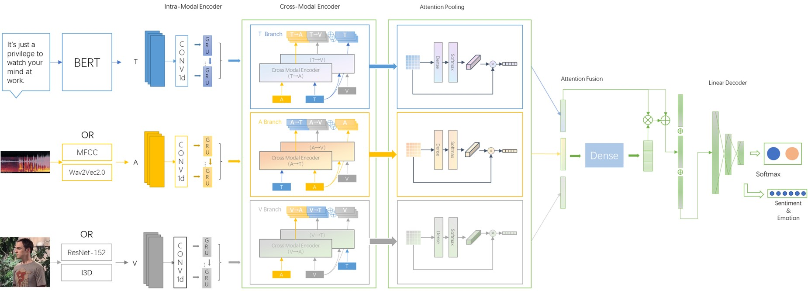

Multi-Modal Sarcasm Detection Using Cross-Modal Attention
===
With the popularity of multimodal social media, multimodal analysis has received much attention recently. However, content with sarcasm is often accompanied by the contrastive emotion polarity between different modalities, which makes the traditional multi-modal fusion method difficult to effectively combine information from different modalities.

this paper proposes a method based on multi-branch cross-modal learning, which perform the detection of sarcasm in dialogue video by learning the difference of information between different modalities. The method takes the pretrained high-level feature sequence as the input, utilized the cross-modal Transformer structure for cross-modal learning, normalizes the sequence by using the sequence attention mechanism, and uses the multi-branch attention fusion mechanism to fuse the representations of different branches. In addition, we applies pretrained Wav2Vec2 features to sarcasm detection for the first time, and its effectiveness compared with traditional artificial acoustic features is verified.

The experimental results on the MUStARD dataset show that the proposed method improves the Speaker Independent training setup, which is challenging and practical, by 5.33% compared with the state-of-the-art results of the dataset.

